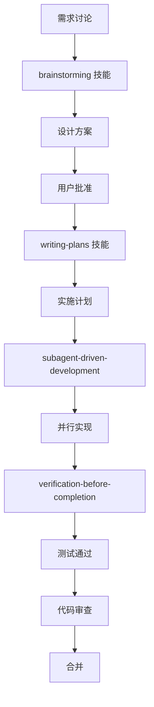

# 剧本杀项目 OpenCode 配置

📍 **位置**: `C:\Users\Flex\Desktop\Codes\剧本杀\docs\opencode\`

本目录包含剧本杀项目的特定 OpenCode 配置、规则和工作流。

---

## 🎭 项目概述

**剧本杀** - LLM 驱动的多玩家在线谋杀谜案游戏

- **后端**: FastAPI + Python
- **前端**: Vue 3 + TypeScript
- **通信**: WebSocket (实时) + SSE (流式)
- **AI**: Local LLM (LM Studio) 作为 DM 主持人

---

## 📁 项目结构

```
剧本杀/
├── server/                    # FastAPI 后端
│   ├── main.py               # 应用入口
│   ├── api/                  # API 路由
│   ├── models.py             # Pydantic 模型
│   ├── game_manager.py       # 游戏状态管理
│   ├── websocket_hub.py      # WebSocket 管理
│   └── game_engine/          # DM 引擎
├── client/                    # Vue 3 前端
│   ├── src/
│   │   ├── components/       # UI 组件
│   │   ├── stores/           # Pinia 状态
│   │   ├── composables/      # Vue composables
│   │   └── types/            # TypeScript 类型
│   └── shared/               # 共享 schemas
├── docs/
│   ├── opencode/             # 本目录 ⭐
│   ├── architecture.md       # 架构概述
│   └── api-reference.md      # API 参考
└── shared/                   # 前后端共享
    ├── ws_types.py           # WebSocket 类型 (Python)
    └── schemas.ts            # Zod schemas (TypeScript)
```

---

## 🎯 推荐 Agent 组合

### 后端开发 (FastAPI/Python)

```typescript
// 主要使用
subagent_type: "python-pro"

// 辅助
- api-architect (API 设计)
- database-architect (数据库设计)
- test-automator (测试编写)
```

### 前端开发 (Vue 3/TypeScript)

```typescript
// 主要使用
subagent_type: "vue-expert"

// 辅助
- typescript-pro (类型安全)
- react-specialist (UI 组件模式，可借鉴)
- test-automator (组件测试)
```

### 全栈任务

```typescript
// 推荐组合
Task(description: "实现游戏房间 API", subagent_type: "python-pro")
Task(description: "实现房间 UI 组件", subagent_type: "vue-expert")
```

---

## 📋 项目特定规则

### 1. 共享类型验证

**前后端必须使用相同的验证 schema**:

```typescript
// ✅ 正确 - 共享 Zod schema
// shared/schemas.ts
export const createRoomSchema = z.object({
  name: z.string().min(1).max(50),
  maxPlayers: z.number().min(2).max(8),
});

// 前端使用
const result = createRoomSchema.safeParse(form.value);

// 后端使用 (通过 Pydantic 转换)
from shared.schemas import create_room_schema
body = create_room_schema.parse(request.body)
```

### 2. WebSocket 消息类型

**所有 WS 消息必须定义类型**:

```python
# shared/ws_types.py
class WSMessage(BaseModel):
    type: str
    payload: dict
    timestamp: datetime = Field(default_factory=datetime.utcnow)
```

```typescript
// client/src/types/ws.ts
export interface WSMessage {
  type: string;
  payload: Record<string, any>;
  timestamp: string;
}
```

### 3. 游戏状态管理

**使用 Pinia store 统一管理**:

```typescript
// client/src/stores/game.ts
export const useGameStore = defineStore('game', {
  state: () => ({
    phase: 'waiting',      // waiting | playing | ended
    act: 1,                // 当前章节
    players: [],
    currentEvent: null,
    clues: [],
  }),
  
  actions: {
    startGame() { /* ... */ },
    advanceAct() { /* ... */ },
    addClue(clue) { /* ... */ },
  }
});
```

### 4. DM 自动模式

**Auto-DM 配置**:

```python
# server/game_manager.py
class GameState(BaseModel):
    dm_auto: bool = True  # 自动 DM 模式
    last_player_activity: datetime
    dm_intervention_history: list = []
```

**触发条件**:
- 玩家空闲 > 60s → DM idle nudge
- 无进展 > 120s → DM event generation

### 5. 权限控制

**管理员操作必须验证**:

```python
# server/middleware.py
async def require_admin(event):
    if not event.path.startswith("/api/rooms/"):
        return
    
    user = await get_current_user(event)
    if not user.is_admin:
        raise HTTPException(403, "Admin required")
```

---

## 🔄 开发工作流

### 新功能开发流程



### 具体步骤

#### 1. 需求讨论 (当前会话)

```typescript
// 描述需求
"我想添加玩家投票功能，需要：
- 玩家可以对嫌疑人投票
- 显示投票进度
- 达到阈值后自动揭示结果"
```

#### 2. Brainstorming

```typescript
// 调用技能
skill: "brainstorming"

// 输出：
- 2-3 种设计方案
- 推荐方案及理由
- 数据流图
- API 设计
```

#### 3. 编写计划

```typescript
// 调用技能
skill: "writing-plans"

// 输出：
- 后端 API (POST /api/rooms/{id}/vote)
- 前端组件 (VotePanel.vue)
- WebSocket 消息 (vote_cast, vote_progress)
- 测试用例
```

#### 4. 并行实施

```typescript
// 启动子代理
Task(
  description: "实现投票 API",
  prompt: plan.backend_section,
  subagent_type: "python-pro"
)

Task(
  description: "实现投票组件",
  prompt: plan.frontend_section,
  subagent_type: "vue-expert"
)
```

#### 5. 验证完成

```typescript
// 调用技能
skill: "verification-before-completion"

// 检查：
- [ ] npx tsc --noEmit 退出码 0
- [ ] pytest tests/ -v 全部通过
- [ ] 无重复验证逻辑
- [ ] WebSocket 消息已缓存
```

---

## 🧪 测试策略

### 后端测试

```bash
# 运行所有测试
pytest tests/ -v --cov

# 特定模块测试
pytest tests/test_game_manager.py -v

# 集成测试
pytest tests/test_integration.py -v
```

### 前端测试

```bash
# 运行单元测试
npm test  # vitest

# 运行类型检查
npm run type-check  # vue-tsc

# 运行 E2E 测试
npm run test:e2e
```

### 质量门控

- [ ] `npx tsc --noEmit` 退出码 0
- [ ] 所有测试通过 (unit + integration)
- [ ] 共享 schemas 无重复
- [ ] WebSocket 消息已缓存
- [ ] API 级别认证已实现

---

## 🐛 常见问题

### 问题 1: WebSocket 连接断开

**症状**: 玩家重新连接后丢失状态

**解决**:
```python
# server/websocket_hub.py
async def on_connect(room_id, player_id):
    # 重发缓存的消息
    pending = manager.get_pending_distributions(room_id, player_id)
    for msg in pending:
        await send(player_id, msg)
```

### 问题 2: LLM 响应超时

**症状**: DM 聊天响应超过 30s

**解决**:
```python
# server/api/dm.py
async def chat_response(request):
    # 使用 SSE 流式返回
    async def generator():
        response = await llm_client.stream_chat(...)
        for chunk in response:
            yield chunk.data
    
    return StreamingResponse(generator())
```

### 问题 3: 游戏状态不一致

**症状**: 不同玩家看到不同的游戏状态

**解决**:
```python
# server/game_manager.py
async def broadcast_state(room_id):
    # 确保所有玩家收到相同状态
    state = get_game_state(room_id)
    for player in get_players(room_id):
        await send(player.id, serialize(state))
```

---

## 📚 参考文档

### 项目文档

- [架构概述](../architecture.md)
- [API 参考](../api-reference.md)
- [CLAUDE.md](../../CLAUDE.md) - 开发规则

### 全局配置

- [OpenCode 全局配置](C:\Users\Flex\.config\opencode\README.md)
- [Windows 环境规范](C:\Users\Flex\.config\opencode\rules\windows-env.md)
- [Agents Reference](C:\Users\Flex\.config\opencode\docs\agents-reference.md)

---

## 🔗 快速链接

### 常用命令

```bash
# 启动后端
uvicorn server.main:app --host 0.0.0.0 --port 8000

# 启动前端
cd client && npm run dev

# 运行测试
pytest tests/ -v && cd client && npm test

# 构建前端
cd client && npm run build
```

### 关键文件

- `server/main.py` - 后端入口
- `client/src/main.ts` - 前端入口
- `shared/schemas.ts` - 共享验证 schema
- `shared/ws_types.py` - WebSocket 类型

---

**最后更新**: 2026-05-11  
**版本**: v1.0
