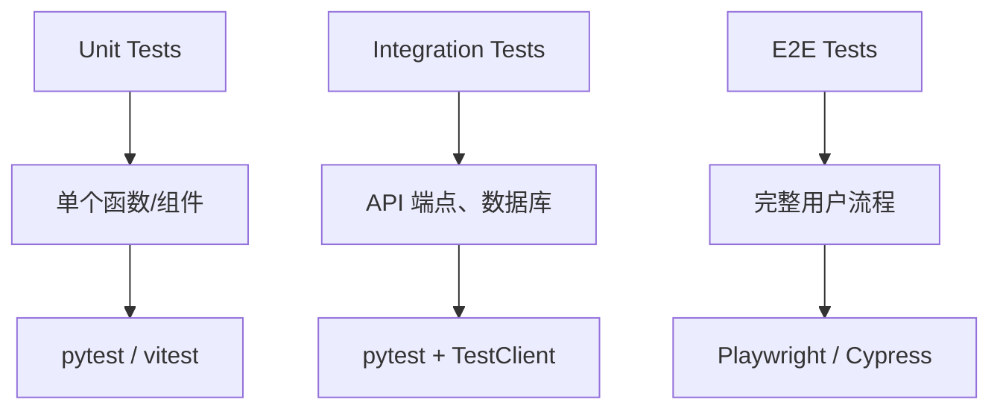

# 剧本杀项目开发规则

📍 **位置**: `C:\Users\Flex\Desktop\Codes\剧本杀\docs\opencode\project-rules.md`

本文件定义剧本杀项目的特定开发规则和最佳实践。

---

## 🎯 核心原则

### 1. 类型安全优先

**从数据库到 UI 的完整类型链**:

```typescript
// ✅ 正确 - 共享 Zod schema
// shared/schemas.ts
import { z } from "zod";

export const createTaskSchema = z.object({
  title: z.string().min(1).max(200),
  priority: z.enum(["low", "medium", "high"]),
});

export type CreateTaskInput = z.infer<typeof createTaskSchema>;
```

```python
# server/models.py (Pydantic v2)
from pydantic import BaseModel, Field

class CreateTaskInput(BaseModel):
    title: str = Field(min_length=1, max_length=200)
    priority: Literal["low", "medium", "high"]
```

**禁止重复验证逻辑** - 前后端使用相同的 schema 定义。

### 2. 验证边界

**每一层都必须验证**:

| 层级 | 验证方式 | 示例 |
|------|---------|------|
| Database | 列类型 + 约束 | `VARCHAR(200) NOT NULL` |
| API | Pydantic/Zod | `createTaskSchema.parse(body)` |
| Frontend | Zod | `createTaskSchema.safeParse(form)` |

### 3. 简单架构

**技术选择决策树**:

```
需要 CRUD + 简单查询？
├─ YES → REST API
└─ NO → 需要复杂嵌套查询？
    ├─ YES → GraphQL
    └─ NO → 继续判断...

单团队/单部署？
├─ YES → Monolith (当前选择)
└─ NO → Microservices

需要实时更新？
├─ YES → WebSockets (当前选择)
└─ NO → SSE / Polling
```

---

## 📐 代码组织

### 后端结构

```
server/
├── api/                    # API 路由模块
│   ├── __init__.py        # 注册所有路由器
│   ├── rooms.py           # 房间管理
│   ├── game.py            # 游戏控制
│   ├── script.py          # 剧本生成
│   ├── dm.py              # DM 聊天
│   └── voting.py          # 投票系统
├── models/                # 数据模型
│   ├── script.py          # Script, Role, Clue
│   ├── game.py            # GameState, Player
│   └── ws_types.py        # WebSocket 消息类型
├── services/              # 业务逻辑
│   ├── game_manager.py    # 游戏状态管理
│   ├── websocket_hub.py   # WebSocket 连接管理
│   ├── llm_client.py      # LLM API 客户端
│   └── script_engine/     # 剧本生成引擎
├── game_engine/           # DM 引擎
│   ├── prompts.py         # DM 提示模板
│   ├── host.py            # 自动 DM
│   └── scheduler.py       # 定时任务
├── di/                    # 依赖注入
│   └── container.py       # 服务容器
├── utils/                 # 工具函数
│   ├── display_name.py    # 玩家名称解析
│   └── endpoint.py        # 端点规范化
└── middleware.py          # 中间件
```

### 前端结构

```
client/src/
├── components/            # UI 组件
│   ├── GamePage.vue       # 主游戏页面
│   ├── RoomList.vue       # 房间列表
│   ├── WaitingLobby.vue   # 等待大厅
│   └── game/              # 游戏内组件
│       ├── AccusationPanel.vue
│       ├── EventDisplay.vue
│       ├── PlayerList.vue
│       └── VotePanel.vue
├── stores/                # Pinia 状态
│   └── game.ts            # 游戏状态管理
├── composables/           # Vue composables
│   ├── useWebSocket.ts    # WebSocket 连接
│   ├── useSSE.ts          # SSE 流消费
│   └── useGameActions.ts  # 游戏操作封装
├── types/                 # TypeScript 类型
│   └── ws.ts              # WebSocket 消息类型
├── api/                   # API 客户端
│   └── index.ts           # Fetch 封装
└── router.ts              # Vue Router 配置
```

---

## 🔐 安全规范

### 认证与授权

**API 级别保护（必须）**:

```python
# server/middleware.py
async def require_admin(event):
    """管理员操作守卫"""
    if not event.path.startswith("/api/rooms/"):
        return
    
    token = get_header(event, "authorization")
    if not token:
        raise HTTPException(401, "Missing token")
    
    user = await verify_token(token.replace("Bearer ", ""))
    if not user.is_admin:
        raise HTTPException(403, "Admin required")
    
    event.context.user = user
```

**禁止前端-only 保护** - 所有敏感操作必须在 API 层验证。

### 数据保护

- ❌ **禁止**: 硬编码密钥在代码中
- ✅ **必须**: 环境变量 (`.env`)
- ✅ **必须**: `.env` 加入 `.gitignore`
- ✅ **推荐**: 使用 secrets manager (生产环境)

```bash
# .env (项目根目录)
LLM_ENDPOINT=http://192.168.1.107:12340/v1
LLM_MODEL=qwen3.5-122b-a10b
LLM_API_KEY=sk-lm-M5HxWams:iF3fpfNWTtwN5XARwsb0
SERVER_HOST=0.0.0.0
SERVER_PORT=8000
```

---

## 🧪 测试策略

### 测试层次



### 测试文件命名

```
tests/
├── test_game_manager.py       # GameManager 单元测试
├── test_websocket_hub.py      # WebSocket 测试
├── test_api_rooms.py          # 房间 API 测试
├── test_api_game.py           # 游戏 API 测试
├── test_script_engine.py      # 剧本引擎测试
└── test_integration.py        # 集成测试
```

### 测试覆盖率要求

| 模块 | 最低覆盖率 |
|------|-----------|
| API 路由 | 80% |
| 游戏逻辑 | 90% |
| WebSocket | 75% |
| 工具函数 | 85% |

---

## 📦 依赖管理

### 共享依赖

**前后端共享**:
- Zod (验证 schemas) - 前端
- Pydantic v2 (验证 schemas) - 后端
- TypeScript types - 通过共享代码生成

**避免重复**:

```typescript
// ❌ 错误 - 重复定义
// backend: title must be 1-200 chars
// frontend: title.length >= 1 && title.length <= 200

// ✅ 正确 - 共享 schema
import { createTaskSchema } from "@shared/schemas";
```

### 版本锁定

```bash
# Backend
pip freeze > requirements.txt

# Frontend
npm install --package-lock-only
```

---

## 🚀 部署流程

### 本地开发

```bash
# 1. 启动后端 (新终端)
cd C:\Users\Flex\Desktop\Codes\剧本杀
uvicorn server.main:app --host 0.0.0.0 --port 8000

# 2. 启动前端 (新终端)
cd C:\Users\Flex\Desktop\Codes\剧本杀\client
npm run dev

# 3. 访问
# 前端：http://localhost:3000
# API: http://localhost:8000/docs
```

### 生产部署

**使用 start.bat / stop.bat**:

```batch
@echo off
REM start.bat - 启动剧本杀服务

REM 启动后端
start "Backend" cmd /k "uvicorn server.main:app --host 0.0.0.0 --port 8000"

REM 等待 2 秒
timeout /t 2 /nobreak

REM 启动前端
start "Frontend" cmd /k "cd client && npm run dev"

echo Services started!
```

---

## 📝 代码审查清单

### 提交前检查

- [ ] 代码符合 PEP 8 (后端) / ESLint (前端)
- [ ] 测试覆盖新增功能
- [ ] 文档已更新 (API 文档、README)
- [ ] 无敏感信息泄露
- [ ] 性能影响已评估

### PR 要求

- [ ] 清晰的描述和截图
- [ ] 关联 issue
- [ ] 至少 1 人 review
- [ ] CI/CD 全部通过

---

## 🔧 性能优化

### 后端优化

```python
# ✅ 使用异步
async def get_game_state(room_id):
    return await db.fetch_one(...)

# ❌ 阻塞操作
def get_game_state(room_id):
    return db.fetch_one(...)  # 阻塞事件循环
```

```python
# ✅ 使用连接池
app.state.db_pool = await asyncpg.create_pool(...)

# ❌ 每次查询新建连接
conn = await asyncpg.connect(...)
```

### 前端优化

```vue
<!-- ✅ 使用 computed -->
<script setup>
const activePlayers = computed(() => 
  players.value.filter(p => p.status === 'active')
);
</script>

<!-- ❌ 重复计算 -->
<script setup>
function getActivePlayers() {
  return players.value.filter(p => p.status === 'active');
}
// 每次渲染都调用
</script>
```

```vue
<!-- ✅ 使用 v-memo -->
<div v-for="player in players" :key="player.id" v-memo="[player.name, player.score]">
  <!-- 复杂组件 -->
</div>
```

---

## 🐛 调试技巧

### 后端调试

```python
# 1. 使用 logging
import logging
logging.basicConfig(level=logging.DEBUG)
logger = logging.getLogger(__name__)
logger.debug(f"Game state: {state}")

# 2. 使用 FastAPI 依赖注入调试
async def debug_middleware(request: Request, call_next):
    logger.info(f"Request: {request.method} {request.url}")
    response = await call_next(request)
    logger.info(f"Response: {response.status_code}")
    return response

# 3. 使用 pytest 调试
pytest tests/ -v --pdb  # 失败时进入交互式调试
```

### 前端调试

```typescript
// 1. Vue DevTools (浏览器扩展)
// - 查看组件树
// - 检查 Pinia state
// - 跟踪事件

// 2. 使用 console.table
console.table(players.value);

// 3. 使用 Vue 开发者工具
import { useDevTools } from '@vue/devtools';
```

---

## 🔗 相关资源

- [全局开发规范](C:\Users\Flex\.config\opencode\rules\development.md)
- [Windows 环境规范](C:\Users\Flex\.config\opencode\rules\windows-env.md)
- [CLAUDE.md](../../CLAUDE.md) - 项目总体说明
- [架构文档](../architecture.md)

---

**最后更新**: 2026-05-11  
**版本**: v1.0
